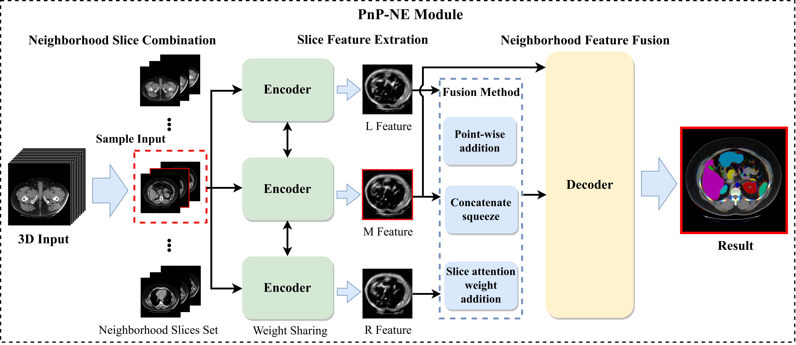

# PnP-NE
The codes for the work "Empowering 2D Neural Network for 3D Medical Image Segmentation via Neighborhood Information Fusion"
- Under Review at **Pattern Recognition**.
- Framework
    - 

- Result on U-Net
    - 

## 1. Prepare data
- BTCV
      - The datasets we used are provided by TransUnet's authors. If you would like to use the preprocessed data, please use it for research purposes and do not redistribute it (following the TransUnet's License).
- BraTS
     - [braTS2013](https://www.smir.ch/BRATS/Start2013)
     - refer to ./tools/BRATS2018_preprocess.py
- ACDC
     - [ACDC](https://www.creatis.insa-lyon.fr/Challenge/acdc/databases.html)
     - refer to ./tools/ACDC_Preprocess.py
## 2. Environment

- Use the command "pip install -r requirements.txt" for the dependencies.

## 3. Train/Test

- Train
    ```
    For example (BTCV):
        - Unet++ add PnP-NE 
            python train.py --dataset Synapse --cfg configs/config_UnetPlusPlus.py --root_path data/SynapseII --max_epochs 150 --output_dir unet++25D_Synapse  --img_size 224 --base_lr 0.05 --batch_size 16 --enable_25D --min_test_epoch 150 --volume_path data/SynapseII/test_vol_h5
        - Unet++ 2D
            python train.py --dataset Synapse --cfg configs/config_UnetPlusPlus.py --root_path    data/SynapseII --max_epochs 150 --output_dir unet++_Synapse  --img_size 224 --base_lr 0.05 --batch_size 24 --min_test_epoch 150 --volume_path data/SynapseII/test_vol_h5
    
    For example (BraTS):
        - Unet++ add PnP-NE 
            python train.py --dataset BRATS2018 --cfg configs/config_UnetPlusPlus.py --root_path data/BRATS2018 --max_epochs 150 --output_dir unet++25D_BRATS2018  --img_size 224 --base_lr 0.05 --batch_size 16 --enable_25D --min_test_epoch 150 --volume_path data/BRATS2018/test_vol_h5
        - Unet++ 2D
            python train.py --dataset BRATS2018 --cfg configs/config_UnetPlusPlus.py --root_path data/BRATS2018 --max_epochs 150 --output_dir unet++_BRATS2018  --img_size 224 --base_lr 0.05 --batch_size 24 --min_test_epoch 150 --volume_path data/BRATS2018/test_vol_h5
    
    For example (ACDC):
        - Unet++ add PnP-NE
            python train.py --dataset ACDC --cfg configs/Unet_plusplus.yaml --root_path data/ACDC --max_epochs 150 --output_dir unet++25D_ACDC  --img_size 224 --base_lr 0.05 --batch_size 16 --enable_25D --min_test_epoch 150 --volume_path data/ACDC/test_vol_h5
        - Unet++ 2D
            python train.py --dataset ACDC --cfg configs/Unet_plusplus.yaml --root_path data/ACDC --max_epochs 150 --output_dir unet++_ACDC  --img_size 224 --base_lr 0.05 --batch_size 24 --min_test_epoch 150 --volume_path data/ACDC/test_vol_h5
    ```
    

- Test
    ```
    For example (BTCV):
        - Unet++ add PnP-NE 
            python test.py --dataset Synapse --cfg configs/config_UnetPlusPlus.py --is_saveni --volume_path data/Synapse --output_dir unet++25D --max_epoch 150 --base_lr 0.05 --img_size 224 --batch_size 16 --enable_25D
        - Unet++ 2D
            python test.py --dataset Synapse --cfg configs/config_UnetPlusPlus.py --is_saveni --volume_path data/Synapse --output_dir unet++ --max_epoch 150 --base_lr 0.05 --img_size 224 --batch_size 24
    
    For example (BraTS):
        - Unet++ add PnP-NE 
            python test.py --dataset BRATS2018 --cfg configs/config_UnetPlusPlus.py --is_saveni --volume_path data/BRATS2018 --output_dir unet++25D_BRATS2018 --max_epoch 150 --base_lr 0.05 --img_size 224 --batch_size 16 --enable_25D
        - Unet++ 2D
            python test.py --dataset BRATS2018 --cfg configs/config_UnetPlusPlus.py --is_saveni --volume_path data/BRATS2018 --output_dir unet++_BRATS2018 --max_epoch 150 --base_lr 0.05 --img_size 224 --batch_size 24

    For example (ACDC):
        - Unet++ add PnP-NE
            python test.py --dataset ACDC --cfg configs/Unet_plusplus.yaml --is_saveni --volume_path data/Synapse --output_dir unet++25D_ACDC --max_epoch 150 --base_lr 0.05 --img_size 224 --batch_size 16 --enable_25D
        - Unet++ 2D
            python test.py --dataset ACDC --cfg configs/Unet_plusplus.yaml --is_saveni --volume_path data/Synapse --output_dir unet++_ACDC --max_epoch 150 --base_lr 0.05 --img_size 224 --batch_size 24
    ```


## 4. Supported models (Welcome to add new 2D neworks)
- √ U-Net
- √ U-Net++
- √ SwinUNet
- √ MissFormer
- √ TransUNet

## 5. Pretrain Model
- TransUNet pretrain (base offical)
    * [Get models in this link](https://console.cloud.google.com/storage/vit_models/):   R50-ViT-B_16, ViT-B_16, ViT-L_16...

- SwinUNet pretrain (base offical)
    * [Get pre-trained model in this link](https://drive.google.com/drive/folders/1UC3XOoezeum0uck4KBVGa8osahs6rKUY?usp=sharing)

